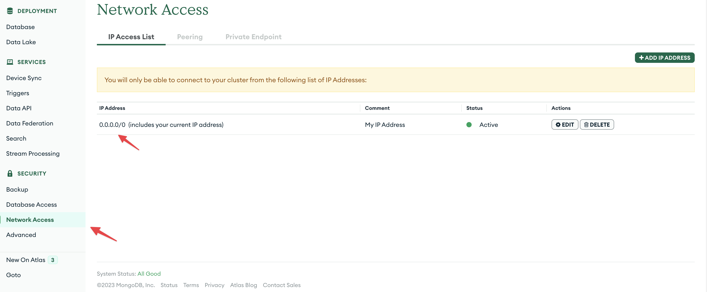
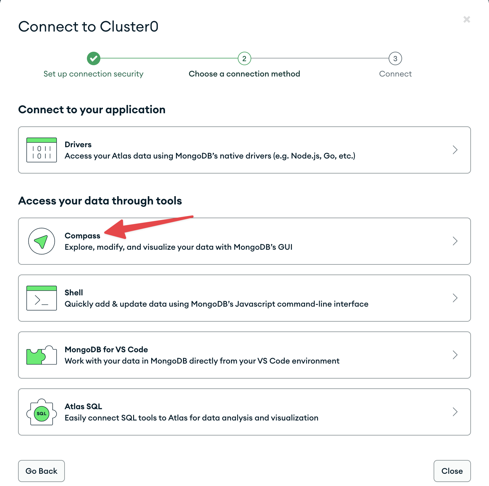
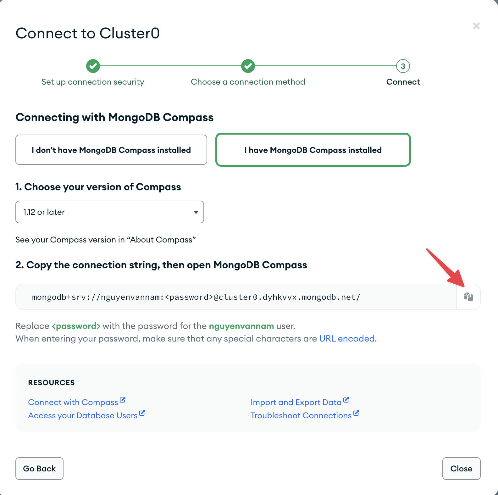
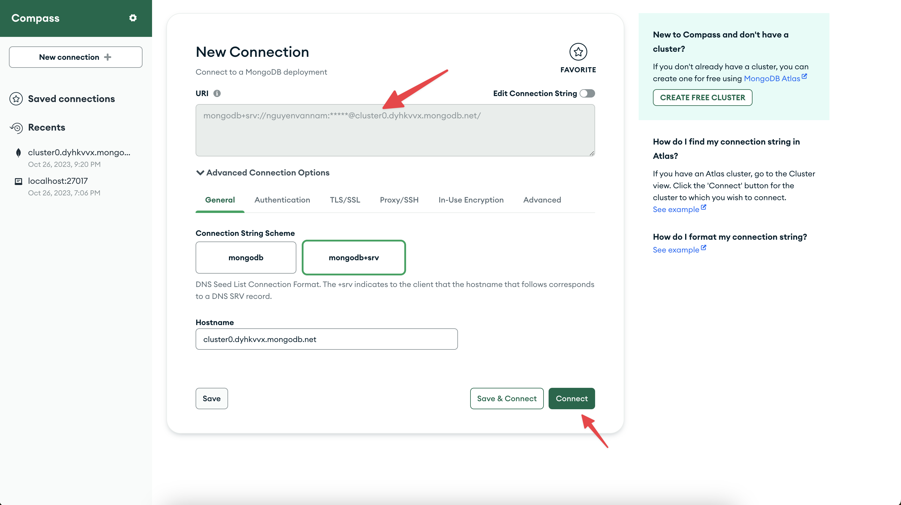

# Youtube-sharing

Youtube-sharing is a web application that allows users to share videos from YouTube

## Features

- Register - Log in
- Share videos from YouTube
- Notification when someone shares a video (When user logged)

## Technologies:

- [ReactJS]
- [ExpressJS]
- [SocketIO]
- [MongoDB]

## Installation

Youtube-sharing requires [Node.js](https://nodejs.org/) v14.20.1+ to run.

Clone repository

```sh
git clone https://github.com/AlexNguyenz/youtube-sharing.git
```

## Manual

Install the dependencies and devDependencies and start the server.

[Create an atlas account]

[Install mongoDB compass]

Change network access on mongo atlas


Select option connect compass


Copy URI


Paste URI into mongoDB compass


```sh
cd youtube-sharing-be
```

Create file .env

```js
API_KEY_YOUTUBE=
MONGO_URI=
URL_FE=http://localhost:3000
JWT_SECRET_KEY=
NODE_ENV=development
PORT=8080
```

| Key             | Value                                   |
| --------------- | --------------------------------------- |
| API_KEY_YOUTUBE | [create api key youtube]                |
| MONGO_URI       | paste URI from mongo atlas <like below> |
| URL_FE          | client port on local                    |
| JWT_SECRET_KEY  | random string                           |
| NODE_ENV        | mode env                                |
| PORT            | server port on local                    |

Create init data

```sh
npm run seeding
```

Start server

```sh
cd youtube-sharing-be
npm run install
npm run dev
```

Install the dependencies and devDependencies and start the client.

```sh
cd youtube-sharing-fe
npm run install
npm run dev
```

## Docker

## License

MIT

[//]: # "These are reference links used in the body of this note and get stripped out when the markdown processor does its job. There is no need to format nicely because it shouldn't be seen. Thanks SO - http://stackoverflow.com/questions/4823468/store-comments-in-markdown-syntax"
[ReactJS]: https://react.dev/
[ExpressJS]: https://expressjs.com/
[SocketIO]: https://socket.io/
[MongoDB]: https://www.mongodb.com/
[Install mongoDB compass]: https://www.mongodb.com/docs/compass/current/install/
[Create an atlas account]: https://medium.com/@zzpzaf.se/mongodb-atlas-free-shared-database-cluster-891435bec3a9
[create api key youtube]: https://www.magetop.com/blog/cach-lay-api-key-youtube/#:~:text=C%C3%A1c%20b%C6%B0%E1%BB%9Bc%20%C4%91%E1%BB%83%20l%E1%BA%A5y%20API%20key%20YouTube,-B%C6%B0%E1%BB%9Bc%201%3A%20T%E1%BA%A1o&text=T%E1%BA%A1i%20Library%20c%C3%A1c%20b%E1%BA%A1n%20search,CREDENTIALS%20%C4%91%E1%BB%83%20t%E1%BA%A1o%20API%20key.
